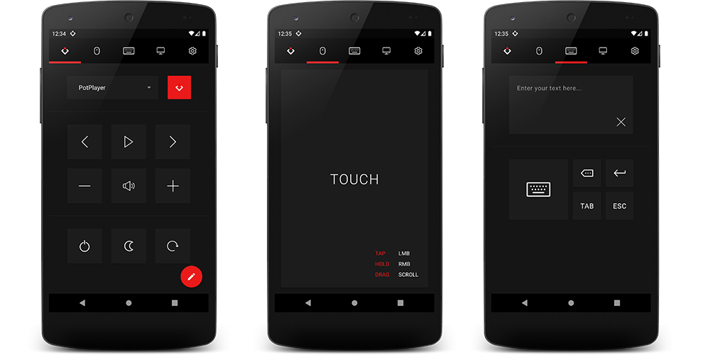

# Poly
Remote control application for Windows using mobile device.

## Features
- Media playback controls
- Mouse control
- Keyboard control
- Shutdown/Sleep/Restart
- Desktop preview
- Custom commands
- Playback control via notification
- Light/Dark theme



## Requirements
#### Server
- Node.js
- npm

#### Client
- Android device (min API 19: **KitKat**)

## Project Setup
#### Server
Install all required dependencies by running the following command in the **/server** directory:
```console
npm install
```
Start server by running the following command in the same directory:
```console
node server.js
```

#### Client
Install using the provided `Poly.apk` file or open the project using Android Studio and run the app on device.

#### Desktop Shortcut
To create a desktop icon for server change the **Start in** property of the `Poly Server` shortcut to your custom directory of server files.
Then you can copy the shorcut to desktop or pin it to start.
